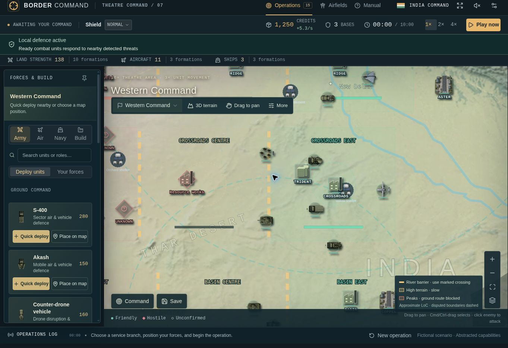
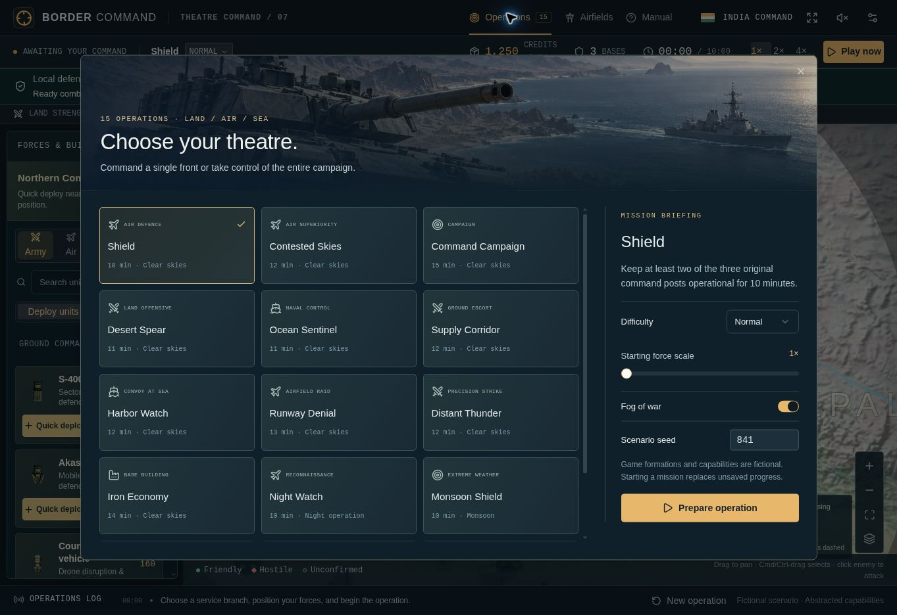

# Border Command

**A browser strategy game by Chaitanya Kulkarni**

I built Border Command around one question: **can a strategy game be easy to start and still have enough depth to keep someone interested?** I wanted players to make decisions about forces, terrain and resources without spending their first session learning a complicated interface.

You command India in fictional conventional scenarios against a computer-controlled Pakistan. Aircraft, ground formations, naval units, drones and air defences have different roles, while connected territory, river crossings and supplies shape your choices.

**[▶ Play Border Command](https://border-command.chaitanyakulkarni841.chatgpt.site)** · [Quick controls](docs/CONTROLS.md) · [How the game evolved](versions/README.md)



*Actual v0.7 gameplay. Use the fullscreen button for more room to command.*

> Fictional scenario • Abstracted capabilities. Geography is recognizable; military sites, deployments and performance values are fictional. “Real-time” means the game simulation, not live intelligence.

## The decisions that shaped the game

- **Make the first action obvious.** I kept Forces & Build pinned, added role-based search and made a click on an eligible enemy issue an attack directly.
- **Keep the player oriented.** Dragging pans the map; Cmd/Ctrl-drag selects a group. Command views, obstacle markings and clickable attack alerts help players move between the overview and a local problem.
- **Automate routine work, keep meaningful choices.** Units defend against nearby eligible threats. Slow resupply and delayed healing happen automatically; spending credits provides faster service.
- **Make depth visible.** Distinct unit symbols, coverage previews, crossing status and EMPTY indicators explain what is happening. Mission reports retain damage even after repairs and show civilian consequences separately from victory.

My priorities changed as I played and refined the idea. I expanded the theatre and movement options, then reduced the map area by 20% when travel and response became the bigger concern. The [decision record](docs/PRODUCT-DECISIONS.md) explains these trade-offs.

## Product portfolio

I have kept the overview short and organized the detail around the questions a reviewer is likely to ask. The numbered index and folder structure follow my earlier portfolio; the content here is specific to this game.

| Section | What it covers | Read |
| --- | --- | --- |
| **00 · Purpose & decisions** | Who I designed for, the problem and the trade-offs I made. | [Context](docs/OVERVIEW.md) · [Decisions](docs/PRODUCT-DECISIONS.md) |
| **01 · Requirements & experience** | PRD, first-session journey, controls and acceptance criteria. | [PRD](docs/PRD.md) · [UX](docs/UX.md) |
| **02 · Gameplay & modes** | Core loop, difficulty, objectives and all 15 scenarios. | [Player loop](workflows/player-loop.md) · [Scenarios](specs/SCENARIOS.md) |
| **03 · Forces & visual language** | All 37 catalogue types, 29 deployable types, roles, values and icons. | [Weapons & units](specs/WEAPONS.md) · [Icon index](specs/ICON-INDEX.md) |
| **04 · Behavior & architecture** | Opponent decisions, information limits, simulation, rendering and saves. | [AI & systems](docs/AI-AND-SYSTEMS.md) · [Architecture](docs/ARCHITECTURE.md) |
| **05 · Evaluation** | Release checks, known limitations and how I would test usability. | [Validation](docs/VALIDATION.md) · [Measurement](docs/MEASUREMENT.md) |
| **06 · Evolution & next steps** | Seven development stages, what changed and what I would validate next. | [Versions](versions/README.md) · [Roadmap](docs/ROADMAP.md) |
| **07 · Play, code & supporting material** | Controls, setup, delivery process and space for my PDFs. | [Guide](docs/CONTROLS.md) · [Source](game/) · [Release](workflows/release.md) · [PDFs](pdfs/) |

## Current version

v0.7 adds wider fighter and air-defence coverage, slow automatic upkeep, visible empty stocks, attackable fictional military infrastructure and a cumulative mission scoreboard. The [version history](versions/README.md) records the exact changes and their source revisions.



*Fifteen operations vary the objective and force mix. [See terrain and mission-report images →](images/gameplay/README.md)*

The release passed **80 automated checks**, type checking and a production build. I have separated those results from the player research and broader device testing still to do in the [validation record](docs/VALIDATION.md).

## Run locally

With Node.js 24 or newer, run from the repository root:

```bash
npm run setup
npm run dev
```

Open the address printed by the server. `npm test` runs the build, type check and regression suite on Linux/WSL. The [developer guide](game/README.md) explains the source layout.

Code lives in `game/`; product documents in `docs/`; editable catalogues in `specs/`; images and icons in `images/`. I have left [pdfs/](pdfs/) ready for my uploads and included reusable [templates](templates/) for future experiments and releases.
