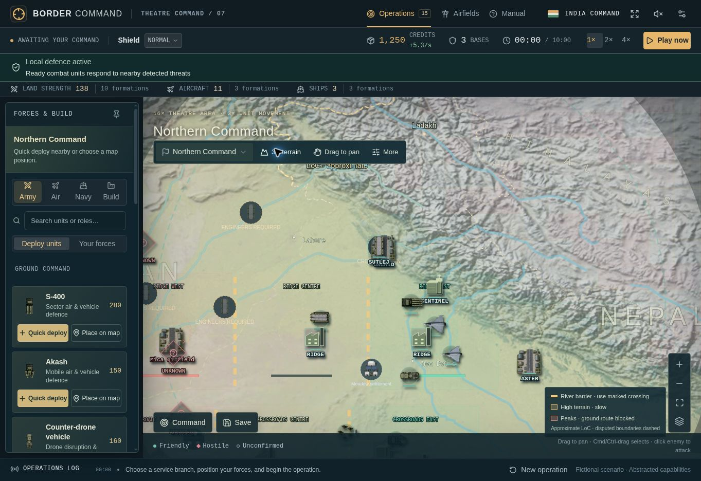
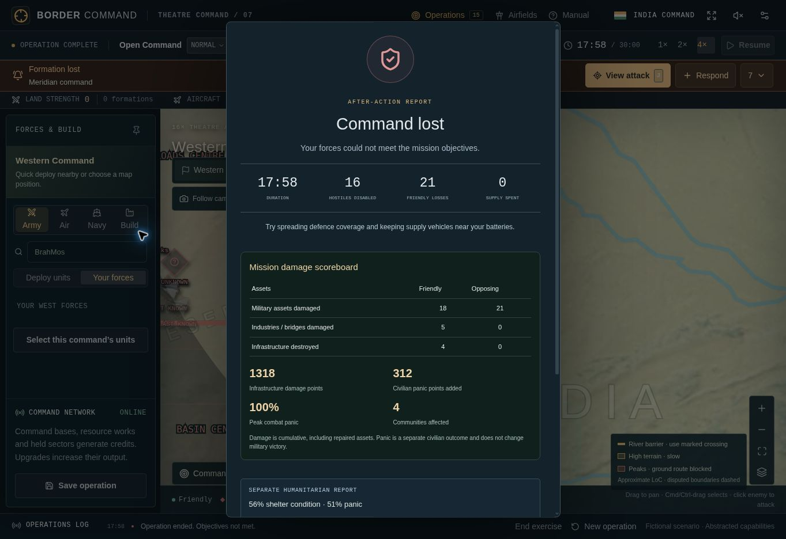

# Inside Border Command

[Portfolio index](../../README.md) · [Play the game](https://border-command.chaitanyakulkarni841.chatgpt.site)

These are actual captures of v0.7, taken on 11 September 2026 at 1363 × 936. I use them here to show how the controls, systems and feedback fit together. They are screenshots of the running game, not concept artwork.

## Command map

The map keeps the immediate choices visible: recruit a formation, inspect its coverage, choose a destination or respond to a warning. The pinned panel avoids repeatedly reopening deployment tools. See the [experience decisions](../../docs/UX.md).

## Terrain and crossings

This is the 2D terrain view. River crossings and high terrain explain movement constraints directly on the map. The optional 3D renderer could not initialize in the capture browser; these images do not claim to demonstrate it. See the [architecture and terrain model](../../docs/ARCHITECTURE.md).

## Choosing an operation

I vary the objective and force mix across 15 operations while keeping the controls consistent. See the [complete scenario catalogue](../../specs/SCENARIOS.md).

## Mission results

This sample Open Command run ended in defeat after 17:58 of simulation time. The report separates military losses, cumulative infrastructure damage and civilian panic; its numbers describe this run only. Damage remains visible after repairs, and panic does not determine victory. See the [player loop](../../workflows/player-loop.md) and [validation record](../../docs/VALIDATION.md).

## Source

Captured from the v0.7 source, including the display correction that labels the existing theatre area as 16×. The corresponding source revision is recorded in [version history](../../versions/README.md). These four views document the interface; they do not constitute a complete browser or usability test.
